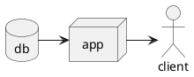

# Texture object

A TextureObject is the representation of a buffer with a specific layout and is inherited by Texture (Texture1D, Texture2D, Texture3D), TextureArray (TextureArray1D, TextureArray2D, TextureArray3D) and TextureList (TextureList1D, TextureList2D, TextureList3D).

A [TextureList](texture_lists.md) is a number of textures within a TextureArray and requires both a uniform buffer binding and a texture binding.

A TextureArray is a Texture with layers and only requires a texture binding.

A Texture is a N-dimensional buffer with a stride specified by the type. It only requires a texture binding.

The texture object can be given to the ShaderRegistry object and this will internally bind the required resources.

